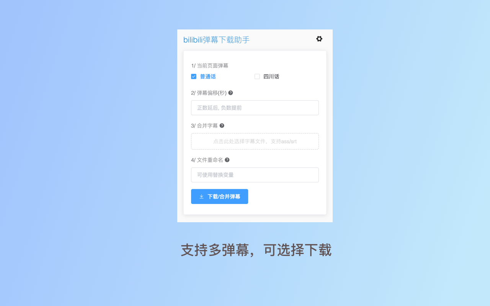

# danmu-assistant-chrome
下载B站的弹幕，合并电影字幕，并输出ass字幕文件

[](https://chrome.google.com/webstore/detail/hghegcgonadcdbkhmkbbphpplhpgkjle) 
[](https://chrome.google.com/webstore/detail/hghegcgonadcdbkhmkbbphpplhpgkjle) 
[](https://chrome.google.com/webstore/detail/hghegcgonadcdbkhmkbbphpplhpgkjle)   
## 预览


## 功能

* 下载B站弹幕
* 合并ass/srt电影字幕


## How to build

```
npm run dev
npm run publish
```

## Thanks

[ass-danmaku](https://github.com/tiansh/ass-danmaku)


## License

Apache License Version 2.0